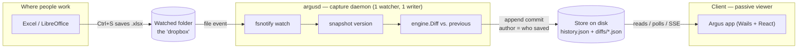
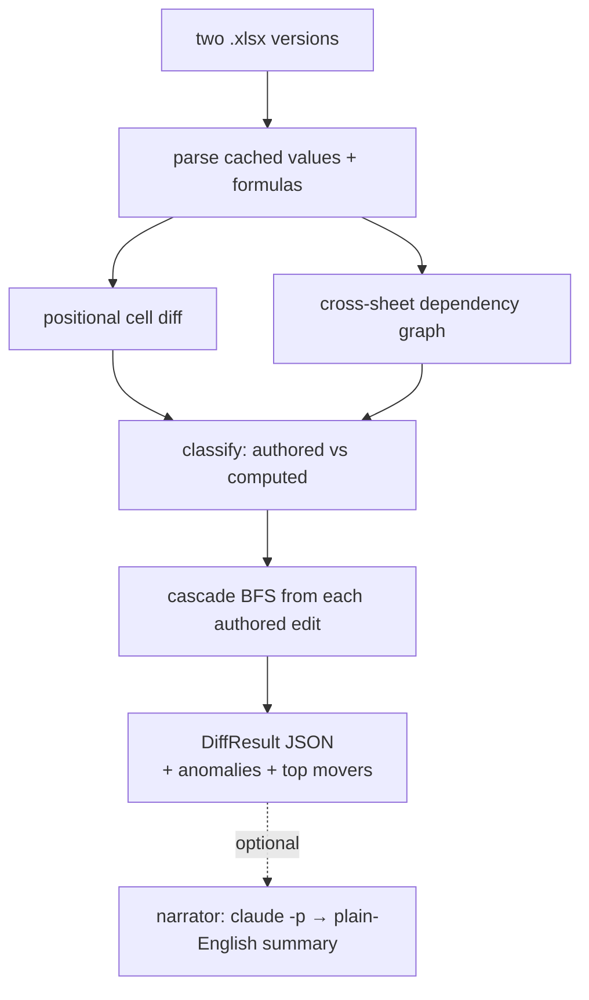

# Argus

Argus is a GitHub-Desktop-style diff tool for Excel workbooks. It opens two
versions of a model and explains what *actually* changed — separating the
handful of inputs a human typed from the hundreds of cells that moved as a
consequence, and tracing every ripple back to the edit that caused it.

The engine **never recomputes spreadsheet values.** It reads the cached values
Excel already stored, diffs them positionally, builds a cross-sheet dependency
graph from the formulas, classifies each change as `authored` or `computed`, and
traces the cascade (blast radius) from each authored edit.

- **Engine** — a deterministic Go diff engine (no AI, no I/O beyond reading files).
- **Narrator** — an optional, strictly separate step that turns a diff into prose via a local `claude -p` call.
- **Daemon** (`cmd/argusd`) — watches a folder and captures/diffs every `.xlsx` save into a store (the "Dropbox model").
- **Client** — a Wails (Go + React/TypeScript) desktop app with a three-pane, GitHub-Desktop layout.

---

## Architecture

Argus follows the **Dropbox model**: a single background **daemon** watches a
folder and is the only thing that touches the raw files, while the **client** is
a passive viewer that reads what the daemon captured. One watcher, one writer —
no two processes fighting over the folder.



- **Single-user:** daemon + client run on the laptop, sharing a local store.
- **Team / self-host:** the daemon runs on a company server, the store is
  central, and clients connect over HTTP/SSE — same design, different location.
- **Resilience:** close the client and the daemon keeps capturing; the store is
  the durable source of truth.

Inside a single diff, the deterministic engine does the hard part — the AI only
narrates the result, never computes it:



---

## Exact Demo

The live "Dropbox" demo — no hardcoded data. Two terminals: the capture daemon,
and the client. As `.xlsx` files land in the watched folder, tracked commits
appear in the client in real time.

```sh
# 0. One-time: a clean watched folder
rm -rf ~/ArgusDropbox

# 1. Terminal A — the capture daemon (run from the repo root)
go run ./cmd/argusd -author "Deal Team A"

# 2. Terminal B — the client
cd desktop/frontend && npm run dev            # → http://localhost:5173
#    (the top bar shows a green "● Live — watching for saves" once connected)

# 3. Build the story LIVE. Each copy = a save = a tracked commit with its real diff.
WB=~/Downloads/argus-files/test-workbooks
cp $WB/atlas_c01_initial.xlsx       ~/ArgusDropbox/Atlas_LBO.xlsx   # base version
cp $WB/atlas_c02_growth_case.xlsx   ~/ArgusDropbox/Atlas_LBO.xlsx   # 1 authored · 40 computed
cp $WB/atlas_c03_margin_tighten.xlsx ~/ArgusDropbox/Atlas_LBO.xlsx  # margin change ripples
cp $WB/atlas_c06_exit_multiple.xlsx ~/ArgusDropbox/Atlas_LBO.xlsx   # the exit-multiple cascade
cp $WB/atlas_c07_hardcode_flag.xlsx ~/ArgusDropbox/Atlas_LBO.xlsx   # ⚠ anomaly, live
```

Click a commit → see the cascade; click a cell → walk the multi-hop dependency
chain. **Two-user variant:** stop the daemon (Ctrl+C) and restart it as a
different author to attribute later saves to them — the history resumes, and the
rail's **author filter** lets you show just one person's changes:

```sh
go run ./cmd/argusd -author "S. Patel (VP)"    # subsequent saves are attributed to Patel
```

> Demo with `npm run dev` (it fetches the live `/store`). `wails build` produces
> the standalone single-binary client but bundles data at build time.

### Live demo test — edit a real file (the "poof" moment)

The always-running, real-time flow — like leaving Slack open. Daemon + client
running (steps above), then:

1. Put a workbook in the folder so it's tracked:
   ```sh
   cp samples/income_statement_v1.xlsx ~/ArgusDropbox/Q3_Report.xlsx
   ```
2. Open `~/ArgusDropbox/Q3_Report.xlsx` in **Excel or LibreOffice**, change an
   input cell (e.g. a growth or margin assumption), and **save** (⌘/Ctrl-S).
3. Within a second the client flashes a **“New change tracked — <you> saved
   Q3_Report.xlsx”** toast and the new version appears at the top of the History
   rail — no refresh, no clicking.
4. Click it → the cascade shows exactly what your one edit moved, and the AI
   summary explains it in plain English.

Attribute saves to different people by restarting the daemon with a different
`-author`; the rail's author filter then isolates each person's changes. This is
the model: the daemon is always running in the background (like Slack/Discord),
and the client updates in real time.

---

## What Argus does

### Engine (`engine/`)

- `Diff(a, b) → DiffResult` — one deterministic call, one JSON contract (`engine/types.go`).
- Reads Excel's **cached values** — never recomputes, never does arithmetic.
- **Positional diff** across every sheet, including row inserts/deletes.
- Builds a **cross-sheet dependency graph** from the formulas.
- **Authored-vs-computed classification** — tells the input you typed from the cell that recalculated because of it.
- **Cascade / blast-radius** BFS — from each authored edit, the full set of downstream cells it moved, with top movers by magnitude.
- **Anomaly detection** — flags formula-replaced-by-constant (hardcoded overrides) and large-magnitude jumps.
- Works on **any** workbook — no reliance on label columns or a fixed layout. Proven by `TestUnlabeledWorkbook` (a sheet with no column-A labels and an arbitrary layout).
- Renders values through Excel's **built-in and custom number formats**.

### Client (`desktop/`)

A three-pane, GitHub-Desktop-style layout:

- **Commit History rail** (left) — click any commit and its diff loads. Includes a **per-cell revision timeline** ("git log for a single cell").
- **Diff column** (center):
  - **Cascade toggle** — flip between *authored-only* (just the inputs) and *show cascade* (inputs plus every computed ripple).
  - **AI summary banner** — the narrator's grounded prose, collapsible.
  - **Adaptive metric cards** — top movers by magnitude, shown only for labeled, model-like sheets (hidden on arbitrary workbooks so the app stays general).
  - **Anomaly ⚠ badges** and per-cell `ƒ` formula markers.
  - **Sheet / tab navigator** ("N changed sheets"), plus muted unchanged sheets for context.
  - **Changes / History tabs**, a version filter, and hover cards.
- **Cell inspector** (right) — select a cell to see the **full multi-hop dependency chain**. Each hop shows the formula and the value move, and is **clickable to jump to that cell** (switching sheets as needed).
- **Top bar** — workbook dropdown, version filter, and a Commit-version modal.
- **Onboarding** — a mocked watch-folder / SSO first-run flow.
- **Themes** — four, persisted to `localStorage`: **Midnight** and **Tokyo Night** (dark), **GitHub Light** and **Solarized Light** (light).

The client renders **real, bundled engine output** — the `c01→c07` commit chain
in `desktop/frontend/src/data/history/` — so the whole UI runs in a plain browser
with no backend. Regenerate it any time with `make fixtures`.

### Narrator (`narrator/`)

An optional AI summary produced by a local `claude -p` call. It is **grounded**:
it narrates only the computed diff (with every number pre-rendered through its
`displayFormat`), never judges whether a value is correct, and never does
arithmetic. If narration fails, the narrative stays `null` and the UI tolerates
it. Has its own tests (`narrator/narrator_test.go`).

## Why not just Google Sheets (or xltrail)?

**Google Sheets tells you a cell *changed*. Argus tells you *why* it changed and
*what it broke*** — on the Excel files finance actually uses, without moving them
to Google, and self-hosted.

- **Finance can't leave Excel.** Google's history only works on Google-format
  files; real PE / IB models (heavy formulas, add-ins, macros, 100k+ cells,
  cloud-forbidden compliance) can't migrate. Argus runs on the actual `.xlsx`
  in place — the daemon captures saves ambiently from your existing SharePoint /
  OneDrive folder.
- **Causality, not a flat edit log.** Google (and xltrail) show *what* changed.
  Only Argus separates the input a human typed (**authored**) from the cells that
  recalculated (**computed**), traces the **cascade / blast radius**, shows the
  **dependency chain with formulas** cell-by-cell, flags **silent errors** (a
  formula replaced by a hardcoded number), and narrates it in plain English.
- **Self-hosted & team-native.** The daemon runs on your server; clients connect.
  Google is cloud-only and requires editing *in* Google.

| | Google Sheets history | xltrail | **Argus** |
|---|:---:|:---:|:---:|
| Works on real Excel files | ✗ | ✅ | ✅ |
| *What* changed (values) | ✅ | ✅ | ✅ |
| *Why* — authored vs computed | ✗ | ✗ | ✅ |
| **Blast radius / cascade** | ✗ | ✗ | ✅ |
| Dependency chain w/ formulas | ✗ | ✗ | ✅ |
| Silent-error / anomaly flags | ✗ | ✗ | ✅ |
| AI plain-English summary | ✗ | ✗ | ✅ |
| Ambient capture of existing files | ✗ | ✗ | ✅ |
| Self-host / on-prem | ✗ | ✅ | ✅ |

The wedge is the **cascade**: nobody else answers *"this one edit moved these 340
cells and dropped IRR 3 points."* That's the reason a reviewer opens the file.

## Screenshots

Screenshots live in [`screenshots/`](screenshots/) (generated by a separate
process).

---

# Developer guide

Everything you need to build, run, and iterate on Argus locally.

## 1. Prerequisites

| Tool          | Version   | Notes                                                         |
| ------------- | --------- | ------------------------------------------------------------- |
| Go            | 1.25+     | `go version`                                                  |
| Node + npm    | 20+ / 10+ | For the React frontend                                        |
| Wails CLI     | v2.11+    | `go install github.com/wailsapp/wails/v2/cmd/wails@latest`    |
| Xcode CLT     | any       | `xcode-select --install` — clang, required by Wails on macOS  |
| LibreOffice   | optional  | Only to **regenerate fixtures** (recalculates cached values)  |

You do **not** need Excel or LibreOffice to build or run Argus — `excelize` reads
`.xlsx` directly and the engine binary is pure Go (CGO-free). LibreOffice is only
used to author/refresh test workbooks so their cached values are stored.

**It's a Go workspace.** `go.work` binds **two modules**:

- **`argus`** (root) — engine, CLI, and narrator. Lean deps (`excelize`, `efp`), so engine tests stay fast.
- **`desktop`** — the Wails app, which pulls in the full Wails/webview graph.

The workspace is what lets `desktop` import `argus/engine` without dragging the
Wails dependency tree into the engine module.

> ⚠️ **Do not move `engine/` or `narrator/` under `internal/`.** Because
> `desktop` is a separate module, Go would then forbid it from importing them and
> the Wails↔engine binding would break.

## 2. Fastest loop — the browser

The whole UI renders from bundled engine output and calls no Wails APIs, so it
runs in a plain browser with instant hot-reload and full DevTools. **No engine,
no second terminal.**

```sh
cd desktop/frontend
npm run dev          # → http://localhost:5173
```

Edit anything under `desktop/frontend/src/` and it live-reloads. This is where
~90% of UI work happens.

## 3. The engine (CLI + tests)

The engine is a one-shot CLI (and an in-process call inside Wails) — **not a
server**.

```sh
# Diff two workbooks → DiffResult JSON on stdout (narrative = null, no model call)
go run ./cmd/argus-diff \
  engine/testdata/atlas_v1_base.xlsx \
  engine/testdata/atlas_v2_exit_multiple.xlsx

# Inspect the grounded narration prompt (no model call):
go run ./cmd/argus-diff --prompt-only  a.xlsx b.xlsx

# Fill summary.narrative via a live `claude -p` call (~3s, needs the claude CLI):
go run ./cmd/argus-diff --narrate      a.xlsx b.xlsx
# Optional: pick the model for --narrate
go run ./cmd/argus-diff --narrate --model claude-sonnet-4-5  a.xlsx b.xlsx
```

Tests and build:

```sh
make test            # go test ./engine/... ./narrator/...
make build           # go build ./...
go vet ./...         # should be clean
```

Test fixtures live in `engine/testdata/` (the `atlas_c01–c07` commit chain, the
`atlas_v*` variants, and `unlabeled_v*`). The canonical demo pair is
`atlas_v1_base.xlsx → atlas_v2_exit_multiple.xlsx` (1 authored input, several
computed ripples).

**Regenerate the bundled UI diffs** after an engine change. `make fixtures` diffs
each consecutive `atlas_c0N → atlas_c0(N+1)` pair and writes real engine output
into `desktop/frontend/src/data/history/`; Vite HMR then picks it up. Single-input
commits get a live `claude -p` narrative baked in.

```sh
make fixtures                                   # uses ~/Downloads/argus-files/test-workbooks
ARGUS_WORKBOOKS=/path/to/workbooks make fixtures  # or point it elsewhere
```

## 4. The native app

Verify the real WKWebView rendering and the live engine binding.

```sh
cd desktop
wails dev            # hot-reloading native app (frontend deps auto-install first run)
# or
wails build          # packages build/bin/argus.app
```

The result is a **single self-contained binary** — pure Go, no runtime
dependencies (no Electron, no Node at runtime). `desktop/app.go` binds
`App.Diff(pathA, pathB) → DiffResult`; Wails auto-generates the JS/TS binding
under `desktop/frontend/wailsjs/`. To go from bundled diffs to live engine
output, `desktop/frontend/src/data/diffs.ts` resolves a commit to its file pair
and calls `window.go.main.App.Diff(...)` — nothing else in the UI changes.

**Rule of thumb:** live in the browser (step 2), run `make fixtures` after an
engine change (step 3), and run `wails dev`/`wails build` to confirm it looks
right in the actual app (step 4).

## 5. Live capture — the daemon (`argusd`)

The "Dropbox model": run the daemon in one terminal, the client in another, and
every save to a watched folder becomes a tracked commit — live, no hardcoded
data.

```sh
# Terminal 1 — the capture daemon (watches a folder, writes the store the client reads)
go run ./cmd/argusd \
  -folder ~/ArgusDropbox \
  -author "M. Rivera"           # who saved it; defaults to your OS user
# default -store is desktop/frontend/public/store, so the dev client serves it at /store

# Terminal 2 — the client
cd desktop/frontend && npm run dev
```

Then drop `.xlsx` files into `~/ArgusDropbox` (it's created for you), or **save
over one** — the daemon snapshots it, diffs it against the previous version,
flags anomalies, and appends a commit attributed to `-author`. The client polls
the store and the new version appears live. Run the daemon as different
`-author`s to show per-person attribution. (Real multi-user auth/SSO is the
server-side piece — see Architecture.)

## 6. Project layout

| Path                          | What it is                                                              |
| ----------------------------- | ---------------------------------------------------------------------- |
| `engine/`                     | The deterministic diff engine. No AI, no I/O beyond reading files.     |
| `engine/types.go`             | The frozen engine ⇄ UI contract (`DiffResult`).                        |
| `engine/testdata/`            | Test workbooks — the `atlas_c*`/`atlas_v*` chain and `unlabeled_v*`.   |
| `narrator/`                   | Optional post-processing: turns a `DiffResult` into grounded prose.    |
| `cmd/argus-diff/`             | CLI — diffs two workbooks, prints `DiffResult` JSON.                   |
| `cmd/argusd/`                 | The capture daemon — watches a folder, writes the store (Dropbox model).|
| `desktop/`                    | Wails desktop shell — `app.go` (Go backend) + `frontend/` (React/TS).  |
| `desktop/frontend/src/`       | The UI: `App.tsx`, `components/`, and `data/` (diffs, refs, formatting).|
| `scripts/gen-fixtures.sh`     | Regenerates the bundled commit-chain diffs from the engine.            |
| `Makefile`                    | `fixtures`, `test`, `build`.                                           |

## The AI boundary

The engine is fully deterministic and emits `summary.narrative = null`. The
narrator is a strictly separate post-processing step — the engine never imports
it. The model only narrates facts already computed, with every number
pre-rendered through its `displayFormat`; it never judges whether a value is
correct, and it never does arithmetic. If narration fails, `narrative` stays
`null` and the UI tolerates it.
